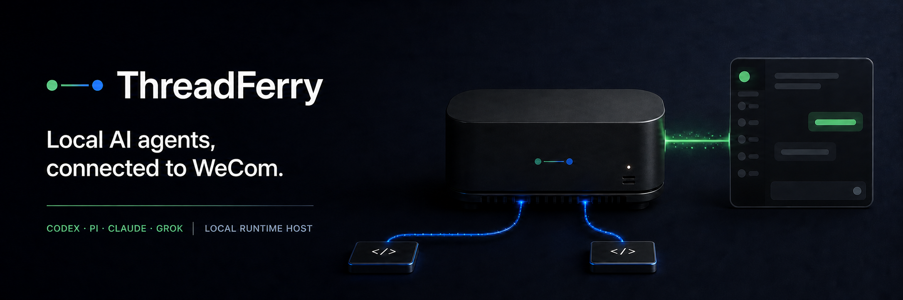
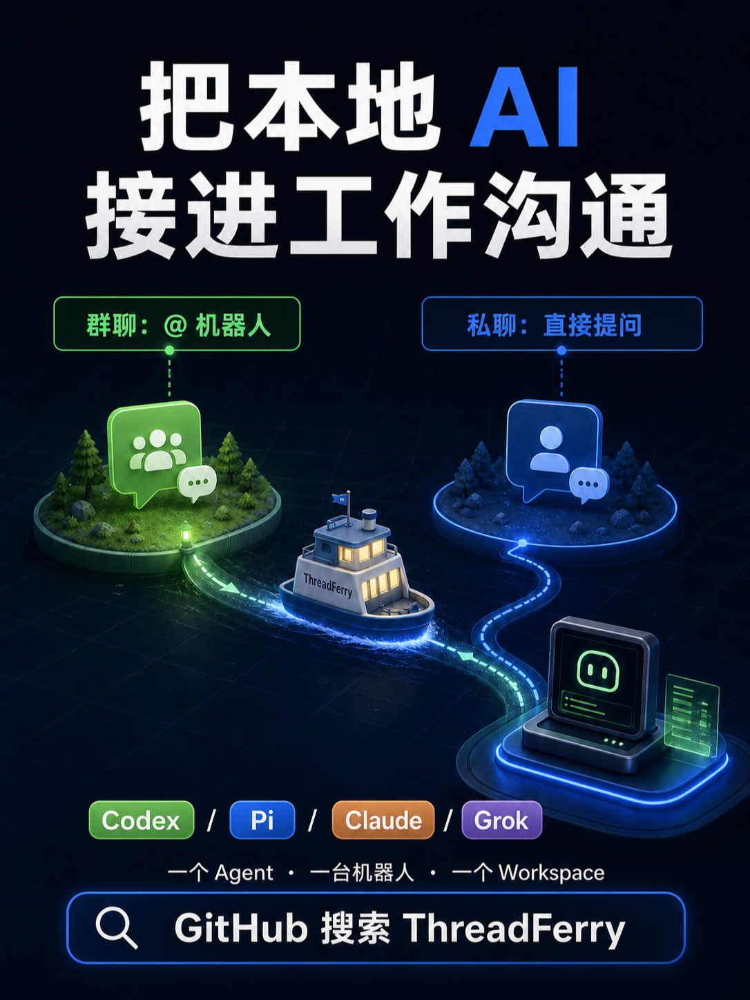
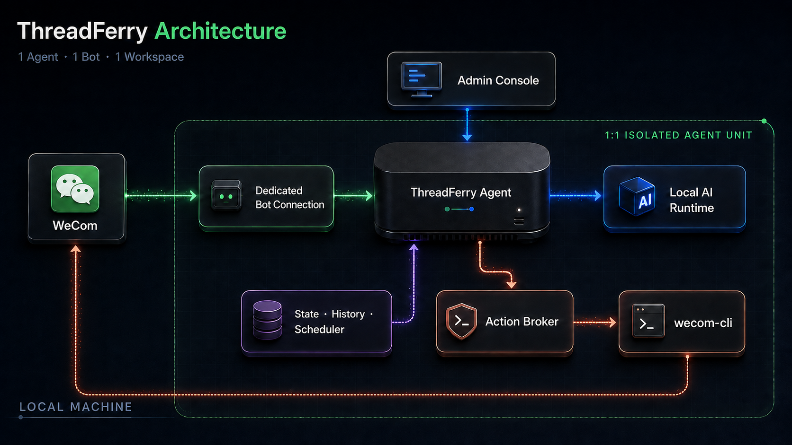

<p align="center">
  
</p>

<p align="center">
  <strong>English</strong> · <a href="./README.zh-CN.md">简体中文</a>
</p>

<p align="center">
  <a href="#architecture">Architecture</a> · <a href="#install">Install</a> · <a href="#first-run">First run</a> ·
  <a href="#chat">Chat</a> · <a href="#security">Security</a> ·
  <a href="#operations">Operations</a> · <a href="./CHANGELOG.md">Changelog</a>
</p>

ThreadFerry connects WeCom to isolated local AI agents. One agent maps to one WeCom AI bot, with its
own Owner, credentials, groups, workspace, runtime, and sessions. Owners can work in direct chat;
authorized members can invoke the bot by mentioning it in configured groups.

<p align="center">
  
</p>

## Capabilities

- Run Codex, Pi, Claude Code, or Grok Build against a fixed local workspace.
- Honor each runtime's native user configuration and workspace instructions, including its local tools,
  skills, plugins, and automation capabilities.
- Read images and UTF-8 text attachments, including quoted and recent chat resources.
- Use the official `wecom-unified` Skill for contacts, calendars, meetings and rooms, todos, mail,
  messages, documents, storage, sheets, smart sheets, and smart pages through a validated `wecom-cli` broker.
- Create reminders and hand work to another agent owned by the same person.
- Recover sessions, queued work, and undelivered replies after restart.
- Keep WeCom connections reconnecting and show each agent's connection and last-callback status in the local console.

ThreadFerry probes contacts, full chat history, and recent-session access during pairing and shows the result.
If the company explicitly denies one of those capabilities, the bot automatically enters compatibility mode:
the current message, local workspace, and runtime automation keep working, while only the restricted feature
is disabled with a precise explanation. Calendar, meeting, mail, document, and other business permissions are
detected on first use. Inconclusive checks remain in a detecting state and are retried in the background; restored
permissions automatically switch the bot back to full mode.

## Architecture

<p align="center">
  
</p>

Each agent owns its bot connection, Owner, credential directory, workspace, runtime, sessions, and
authorized groups. The runtime handles the task and only proposes enterprise actions; ThreadFerry
validates and executes them with that agent's credentials. State, chat history, reminders, work items,
and delivery queues remain partitioned by agent or conversation.

## Install

Requirements:

- macOS, Linux, or Windows
- Node.js 22+
- A WeCom AI bot
- One runtime: Codex CLI `0.138.0+`, Pi CLI `0.84.2+`, Claude Code `2.1.233+`, or Grok Build `1.0.5+`
- Official `wecom-cli 1.2.0+` (the installer adds the tested 1.2.0 release when needed)

macOS or Linux:

```sh
curl -fsSL https://raw.githubusercontent.com/GnaixEuy/threadferry/main/install.sh | bash
```

Windows PowerShell:

```powershell
irm https://raw.githubusercontent.com/GnaixEuy/threadferry/main/install.ps1 | iex
```

After upgrading an existing installation, run:

```sh
threadferry skills install
threadferry doctor
```

This replaces the legacy split `wecomcli-*` Skills with the official `WecomTeam/wecom-unified` Skill
and verifies `wecom-cli 1.2.0+`. Existing per-agent bot credentials do not need reauthorization.

After installing the CLI and completing first-time setup, Windows and Linux users can download the
NSIS, AppImage, or DEB desktop package from [GitHub Releases](https://github.com/GnaixEuy/threadferry/releases/latest).
On macOS, use a desktop package only when the release includes a Developer ID-signed and Apple-notarized
DMG; the CLI installation above works locally when no DMG is published. The desktop app adds the tray
entry; the runtime and official `wecom-cli` continue to use the local installation and login above.

## First run

Run the onboarding wizard in an interactive terminal:

```sh
threadferry onboard
```

The wizard installs the official WeCom Skill, authorizes the bot, identifies its Owner, selects a
runtime and workspace, runs diagnostics, and starts ThreadFerry.

After that, open the ThreadFerry desktop app. It starts configured agents automatically. Its menu-bar
or notification-area icon opens the admin console, restarts or stops the service, reveals the log, and
quits cleanly. Closing the admin window only returns it to the tray.
The lower-left console utilities include trace logs and Preferences. Trace logs locate sanitized records by
error ID, agent, action, or resource, and can prefill the current results in a GitHub Issue. The entry can be hidden in Preferences. Preferences also controls the theme,
launch at login, automatic service startup, opening the console after startup, and the optional macOS Dock
entry. On first open, the console shows a state-driven getting-started checklist and a three-step interface
tour. The checklist collapses after bot authorization and the first Owner direct message; group setup remains
optional, and the tour can be skipped or restarted from Preferences. The overview also visualizes sanitized
runtime state with a seven-day processing trend and task-status distribution. The desktop app checks for updates
after launch and every six hours, downloads and verifies them in the background, waits for active work to drain,
then installs and restarts automatically. Preferences also offers an immediate check. Desktop preferences stay
on the device.

For terminal operation, configured agents can still be started with:

```sh
threadferry start
```

The local admin console is available at
[http://127.0.0.1:17638](http://127.0.0.1:17638). It manages agents, bot authorization,
workspaces, groups, users, sessions, reminders, work items, and recent activity.

## Chat

The Owner can send an ordinary direct message:

```text
Investigate why login requests started timing out.
```

An authorized member can mention the bot in a configured group:

```text
@Bot Summarize the discussion and inspect the relevant code.
```

Group requests include up to 80 messages from the preceding 6 hours as untrusted context. Direct
requests include up to 80 messages from the preceding 7 days. Ordinary group messages do not start a
runtime.

### Enterprise data and actions

Ask for an enterprise task in natural language, for example:

```text
List my meetings this afternoon.
Create a 30-minute review meeting tomorrow at 10:00.
Append these rows to the project smart sheet.
```

The agent follows the official `wecom-unified` Skill and its business-domain references to select the
capability, clarify missing input, build the current CLI command, and interpret the result. ThreadFerry
validates the Skill source, command shape, identity, conversation boundary, requested effect, and
confirmation policy, then runs the command with that agent's own `wecom-cli` credentials. Results return
to the same agent.

Queries run only in Owner direct chat. Every write receives a local `--dry-run` validation first.
Destructive operations, overwrites, completing todos, sending messages, and sending mail require a
fresh Owner confirmation code.

If a submitted write times out while waiting for its result, ThreadFerry reports the final state as unknown and never retries
automatically. Query the target data before deciding whether to run it again. Group receipts from confirmed actions are stored
in the durable delivery queue, so a failed immediate delivery can be retried after reconnect or restart.

### Images and files

Send an image or file in Owner direct chat, or attach or quote it while mentioning the bot in a
configured group. UTF-8 text is available to every runtime; images use each runtime's native visual
input. Unsupported binary formats are reported as received but unavailable for parsing.

One resource is limited to 20 MB and one turn to 50 MB. Each agent retains up to 7 days, 1,000
messages, and 200 MB of authorized chat history under `~/.threadferry/history/<agent>/`. Agent and chat
partitions remain separate. Runtime copies are removed after the turn, and stored history never
contains resource URLs, AES keys, media IDs, or temporary paths.

Grok Build accepts encoded image requests up to 700 KB. Use Codex, Pi, or Claude for larger images.

### Agents and groups

Add and authorize another agent from the admin console or terminal:

```sh
threadferry agent add --name reviewer --runtime pi --workspace /absolute/path/to/project
threadferry agent login reviewer
threadferry agent list
```

Claude Code and Grok Build use their local CLI login and model configuration:

```sh
claude auth login
threadferry agent add --name claude-reviewer --runtime claude --workspace /absolute/path/to/project

grok login
threadferry agent add --name grok-reviewer --runtime grok --workspace /absolute/path/to/project
```

The Owner manages a bot's groups by sending commands in direct chat with that bot:

| Command | Purpose |
| --- | --- |
| `threadferry groups` | List visible groups and their availability state |
| `threadferry users <group>` | List authorized users |
| `threadferry invite <group>` | Create a one-time invitation code |
| `threadferry add <group> <name>` | Authorize a user |
| `threadferry remove <group> <name>` | Remove a user |
| `threadferry open <group>` | Allow every group member to invoke the bot |
| `threadferry close <group>` | Restore the authorized-user list |
| `threadferry disable <group>` | Stop the bot while preserving access and session state |
| `threadferry enable <group>` | Enable or reconnect the bot |
| `threadferry unbind <group>` | Remove the ThreadFerry binding and clear access and session state |
| `threadferry whoami` | Show the caller's ThreadFerry userid |

Add the bot to an internal group and mention it once. ThreadFerry enables that bot for the group on
the first callback, with only its Owner authorized by default. The admin console group detail page
can stop, reconnect, or remove the ThreadFerry binding and manage who may use it; no separate binding
step is required. A natural-language request to remove the bot is recognized and asks the Owner to
confirm with `threadferry unbind`.

Unbinding does not remove the bot from the WeCom group member list because the current official API
does not expose a bot-initiated leave operation. A group administrator must remove it in WeCom.
ThreadFerry keeps a removed marker so discovery or another mention cannot silently reconnect it;
`threadferry enable` reconnects it. Group discovery covers groups with messages in the last seven days.

## Security

- Direct-agent requests are accepted only from that bot's Owner.
- Stopped or removed groups, unauthorized users, and messages without a bot mention do not start a runtime.
- Agents do not share credentials, Owners, sessions, chat history, or workspace access.
- ThreadFerry does not override the local permission configuration of Codex, Pi, Claude Code, or Grok
  Build. They load their native user configuration, workspace instructions, skills, plugins, and tools,
  which may allow commands, file changes, or network access.
- Grant bot access only to trusted users and groups, and configure approvals or sandboxes in each runtime.
  WeCom actions should still go through `threadferry-action` for broker validation, confirmation, and audit.
- Bot credentials remain in each agent's encrypted `wecom-cli` store. ThreadFerry does not persist Bot
  Secrets in configuration, state, logs, URLs, fixtures, or environment variables.
- Chat history, quoted messages, attachments, and enterprise content are always untrusted input.

## Operations

```sh
threadferry doctor
threadferry skills install
threadferry status
threadferry agent list
threadferry update
```

Start selected agents with `threadferry start --agents frontend,reviewer`. Reset a group session with
`threadferry session reset --group <group-id>`.

Local files:

- Configuration: `~/.threadferry/threadferry.yaml`
- State: `~/.threadferry/state-v3.json`
- Per-agent credentials: `~/.threadferry/wecom/<agent>/`
- Example configuration: [threadferry.example.yaml](./threadferry.example.yaml)

## Development

```sh
npm ci --ignore-scripts
npm run typecheck
npm test
npm run desktop:pack
```

Use [POC.md](./POC.md) for acceptance testing and [CONTRIBUTING.md](./CONTRIBUTING.md) for the Gitmoji
commit convention. Licensed under [MIT](./LICENSE).
